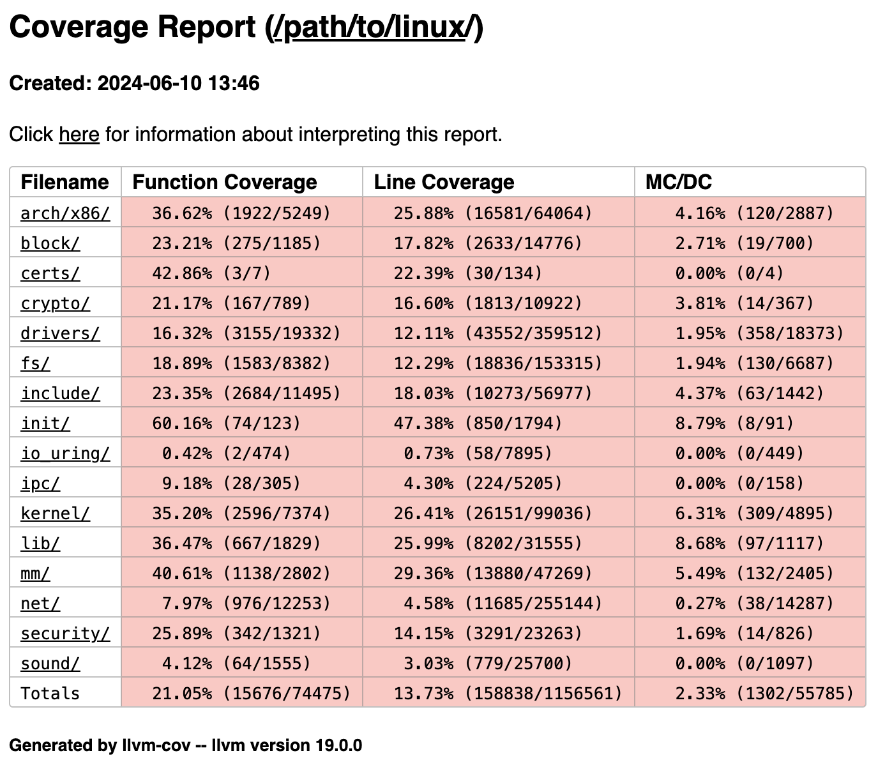

This project is a collaboration between The Boeing Company and University of
Illinois Urbana-Champaign.

[[Get started (LLVM 19)](https://github.com/xlab-uiuc/linux-mcdc/blob/llvm19/docs/measure-kernel-mcdc.md)]
            [[(LLVM 18)](https://github.com/xlab-uiuc/linux-mcdc/blob/public-approved/docs/measure-kernel-mcdc.md)]

More materials will be posted here as soon as they are approved. Please stay
tuned!

Tentative repository structure:

```text
linux-mcdc
│
├── docs
│   ├── elisa-slides.pdf
│   └── measure-kernel-mcdc.md
│
├── scripts
│   ├── build-llvm.sh
│   └── q
│
├── patches
│   ├── README.md
│   └── {v0.4,v0.5}
│       ├── 0000-cover-letter.patch
│       ├── 0001-clang_instr_profile-add-Clang-s-Source-based-Code-Co.patch
│       ├── 0002-kbuild-clang_instr_profile-disable-instrumentation-i.patch
│       └── 0003-clang_instr_profile-add-Clang-s-MC-DC-support.patch
│
├── screenshot.png
└── README.md
```

We gave an ELISA seminar titled "Making Linux Fly: Towards Certified Linux
Kernel".
[[recording](https://elisa.tech/blog/2024/05/28/making-linux-fly-towards-certified-linux-kernel/)]
[[slides](./docs/elisa-slides.pdf)]

Please feel free to open Issues/PRs if you have any suggestions or questions.
You can also send emails to:

- Steven H. VanderLeest <Steven.H.VanderLeest@boeing.com>
- Wentao Zhang <wentaoz5@illinois.edu>
