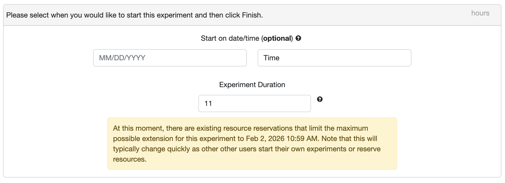
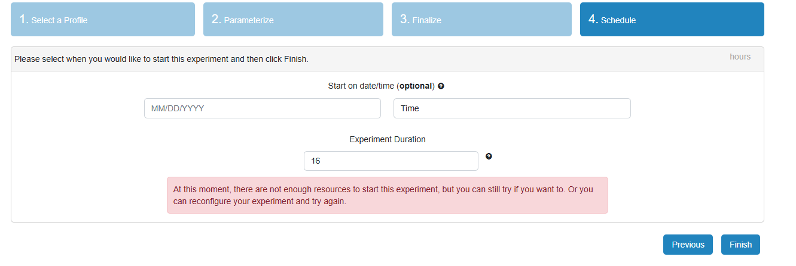
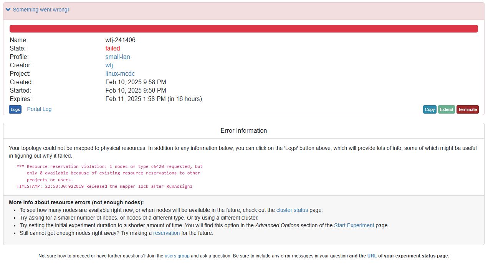

## 1. Create an account

### 1.1 If this is your first CloudLab account...

Go to https://www.cloudlab.us/signup.php?pid=linux-mcdc

In the left column, fill in your personal information.

- One step will ask you to upload your SSH pubic key. Only RSA is supported.
  You can add more keys afterwards.

In the right column, nothing has to be changed: "Join Existing Project" should
have been chosen; "linux-mcdc" should have been auto-filled as Project ID.

### 1.2 If you have a CloudLab account before...

WIP

<!-- Go to https://cloudlab.us/.

Log in with you previous account.

In your User Dashboard, click the top-right button with your user name.

Click "Start/Join Project".

Choose "Join Existing Project" and type "linux-mcdc" as Project ID. -->

## 2. Create an experiment

After your account is approved, log in to your User Dashboard, click the
top-left button "Experiments". Click "Start Experiment".

<!-- Experiment means... -->

1. "Select a Profile": Click "Next"
2. "Parameterize":
    - "Select OS image": Select an OS image
    - "Optional physical node type": Select a cluster and a machine type,
      e.g. "Cloudlab Clemson" -> "c6420"/"c6320"/"c8220" etc. Detailed
      specs of each machine type can be found
      [here](https://docs.cloudlab.us/hardware.html). Machines are not always
      available, check current availability [here](https://www.cloudlab.us/resinfo.php)
      (login required).
    - You can keep other fields their defaults. Click "Next"
3. "Finalize"
    - "Name": Give your experiment a name. This is recommended as you will have
      a predictable domain name. E.g.

      ```text
      node0.<your name goes here>.linux-mcdc-PG0.clemson.cloudlab.us
            |                     |              |
            experiment name       project name   cluster
                                                 name
      ```

    - "Project" (if asked): Select "linux-mcdc".
4. "Schedule":
    - Wait for a few seconds, in some cases, you will see warnings like the
      below popping up:

        <details><summary>Expand/Collapse</summary>

        

        It means your machine type is only available for a short while or
        not available at all. Check availability [here](https://www.cloudlab.us/resinfo.php)
        and try a different machine type.

        </details>

    - Otherwise, click "Next"

Wait for the experiment to become ready (usually taking a few minutes). Go to
the "List View" tab, and you will find the needed `ssh` command to log in to the
machine. (Or you can use the more predictable domain name described above)

**By default the experiment lasts for only 16 hours.** See "FAQ" for how to
extend it.

## FAQ

- For what it's worth, most machines types on CloudLab are physical machines,
  not virtual machines.
- "What machine type should I choose?" It really depends on your needs.
  Wentao often uses "c6420", "c6320", "c8220" because of their mediocre
  performance and thus higher availability. They have huge RAM but are not
  so good in terms of CPU or disk (HDDs) compared to some top-tier
  consumer PCs. "What about GPU?" Wentao barely knows their existence.
  Read [CloudLab hardware specs](https://docs.cloudlab.us/hardware.html).
- Errors like the below screenshots:

    <details><summary>Expand/Collapse</summary>

    

    

    </details>

    Most likely your selected machine type is not available at the moment.
    Check availability [here](https://www.cloudlab.us/resinfo.php) and try
    a different machine type.

- SSH configurations you may find helpful. `man 5 ssh_config` for their
  purposes and security implications.

    ```sshconfig
    Host foo
        User wtj
        HostName node0.foo.linux-mcdc-PG0.clemson.cloudlab.us
        IdentityFile ~/.ssh/id_rsa_cloudlab_only
        ForwardAgent yes
        StrictHostKeyChecking no       # <=
        UserKnownHostsFile /dev/null   # <=
    ```

- Experiment extension: if your experiment was created no longer than 1 week
  ago, you can extend it for another 7 days "for free".

    1. Click the "Extend" button
    2. Choose 7 days. (More than 7 days will need CloudLab staff intervention)
    3. Type in your short explanation
    4. Click the "Request Extension" button

  If your experiment was created more than 1 week ago, your extension will need
  approval from CloudLab staff, which is not guaranteed.

- Disks and partitions. For some machine types the rootfs is only allocated a
  small portion of the full disk. You probably want to gain more space. For
  example the following commands can expand `/dev/sda3` as much as possible on
  "c6420", "c6320", "c8220" etc where `/dev/sda3` is their rootfs partition.

    ```shell
    sudo apt update
    sudo apt install cloud-guest-utils
    sudo growpart /dev/sda 3
    sudo resize2fs /dev/sda3
    ```

- Any project member can access any experiment in this project via key-based
  authentication even if it was not created by themselves. **But the practice of
  this project is everyone works in their own experiment,** to minimize
  interference. Let the other person know before logging in to their machines.
- Wipe all data & config and reset your machine to its initial state:

    1. Go to the "Topology View" tab
    2. Click the icon for you machine (which by default has a name "node0")
    3. Click "Reload"
    4. If you are sure, click "Confirm"

- Automation tips
    - CloudLab instances come with `geni-get` utility installed by default
      that can query CloudLab metadata. Example usage:

        <details><summary>Expand/Collapse</summary>

        ```shell
        # Experiment name
        geni-get slice_urn | rev | cut -d '+' -f 1 | rev

        # "apt install libxml2-utils" for running commands below

        # Node name, in the form of clnode<NNN>
        geni-get portalmanifest | xmllint - --xpath "string(/*[local-name() = 'rspec']/*[local-name() = 'node']/*[local-name() = 'vnode']/@name)"

        # Hardware type, e.g. c6420
        geni-get portalmanifest | xmllint - --xpath "string(/*[local-name() = 'rspec']/*[local-name() = 'node']/*[local-name() = 'vnode']/@hardware_type)"

        # Predictable domain name, in the form of node<N>.<experiment>.<project>.<cluster>.cloudlab.us
        geni-get portalmanifest | xmllint - --xpath "string(/*[local-name() = 'rspec']/*[local-name() = 'node']/*[local-name() = 'host']/@name)"

        # IP address
        geni-get portalmanifest | xmllint - --xpath "string(/*[local-name() = 'rspec']/*[local-name() = 'node']/*[local-name() = 'host']/@ipv4)"
        ```

        </details>

    - [CloudLab portal API](https://docs.cloudlab.us/advanced-topics.html#%28part._portal-api%29) for managing instances programmatically.
    - Browser extension: https://github.com/yimingsu01/cloudlab-extension
    - Misc vibe-coded [user scripts](./user-scripts)
