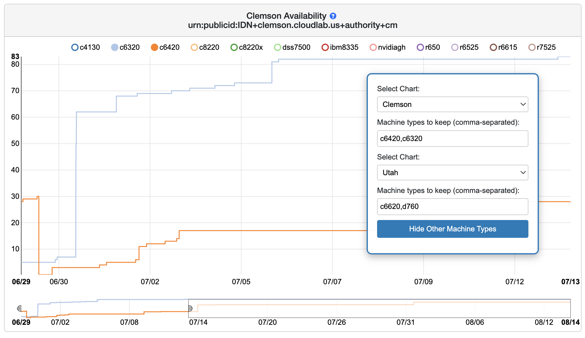

Vibe-coded [Tampermonkey](https://www.tampermonkey.net/) user scripts for
CloudLab. Use with discretion.

- `cloudlab_resinfo.user.js`: Unselect unwanted machine types faster on
  https://www.cloudlab.us/resinfo.php

    

- `cloudlab_grub_interrupt.user.js`: Automatically capture GRUB screen and stop
  there in console instead of anxiously waiting for the preceding boot sequence.

    [cloudlab_grub_interrupt.webm](https://github.com/user-attachments/assets/af6dbc6f-5ff8-4fdf-b5ab-7962e6ed3fae)
